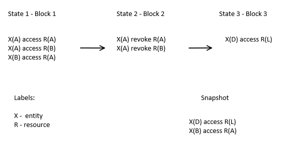

## Nanostima Project
 
### Logbook

#### 1. [1-13]/05/17
- SOTA:
    - Why Distributed Public Ledgers such as Blockchain will not solve the identification and thus the authentication problem [LINK](https://www.kuppingercole.com/blog/kuppinger/why-dpl-will-not-solve-the-identification-and-thus-the-authentication-problem)
    - The Voyage of Discovery: Blockchain for Pharmaceuticals and Medical Devices  [LINK](http://beyondstandards.ieee.org/general-news/voyage-discovery-blockchain-pharmaceuticals-medical-devices/)

    - Mastering Blockchain - Imran Bashir
    
    - Proof-of-work
        - [PoET-intel](https://www.quora.com/What-is-your-opinion-on-PoET-intel-blockchain)
        - [Blockchain-Consensus-Models](https://www.persistent.com/wp-content/uploads/2017/04/WP-Understanding-Blockchain-Consensus-Models.pdf)
        - [blockchain-consensus](http://dailycoin.info/short-guide-blockchain-consensus-protocols/)

    - AAL Intro: caalyx, ecaalyx and caalyx-mV

- Hands-on: 
    - Etherum: 
        - [use-geth-to-setup-your-own-private-ethereum](https://medium.com/blockchain-education-network/use-geth-to-setup-your-own-private-ethereum-blockchain-86f1200e6d40)
        - [private-chain](https://souptacular.gitbooks.io/ethereum-tutorials-and-tips-by-hudson/content/private-chain.html)
    - [Sawtooth lake](https://intelledger.github.io/introduction.html)
    - [Naivechain](https://github.com/lhartikk/naivechain) . [Blog](https://medium.com/@lhartikk/a-blockchain-in-200-lines-of-code-963cc1cc0e54)
    - [deploying-a-private-Ethereum-blockchain](http://hypernephelist.com/2016/05/30/deploying-a-private-Ethereum-blockchain.html)

#### 2. [13-31]/5/17
- Implementation of a PoC of a blockchain for Access Authorization
    - Based on Access Control List and Naivechain
    - Reverse hash calculation as Proof-of-work (partial hash collision)
    - REST API Model
    - Storing / SQLite3
    - Preliminary Scalabilty & Fault-tolerance testing
- SOTA:
    - The Byzantine Generals Problem
    - Access Control in eHealth Scenarious

#### 3. [1-17]/6/17
- Literature Review & Related Work on Blockchain, Access Control and eHealth Data Security
- WIP on Scalabilty & Fault-tolerance testing
- Write and submit paper for ACSAC'17 conference (CORE A)
- *Further research directions*:
    - Further testing and validation
    - Use cases and Scenarious
    - Orchestration of scalability testing with metrics

#### 3. [19-30]/6/17
- Scalabilty testing
    - Tools and evaluation of resutls
    - Complementing ACSAC paper metrics with new results
    - Docker-compose problem/solutions
- *Side Tasks*:
    - PAAMS 17 attendance and presentation (21-23)
    - Scala Swarm attendance (21-23)
        

### Sidenotes

1. How to "snapshot" generic/random operations? 
  - Bitcoin has always a value / transaction stable specification
  - R: ACL
2. Need of local storage?
3. Temporal access vs rule-override
4. Group and individual ACL (e.g. nurses vs doctor x)
  - Fine-Grained Access Control with Object-Sensitive Roles
5. Permissions: Read / Write / R&&W
6. Snapshots?
  - At every 10 iterations do a snapshot, adding metadata
    - {ops: [ -- ], meta: {timestamp, entityname, snapshot(T/F)} }
  - Two-level blockchain
    - snapshots + blocks

7. Sidechain for snapshots

### Institutions

